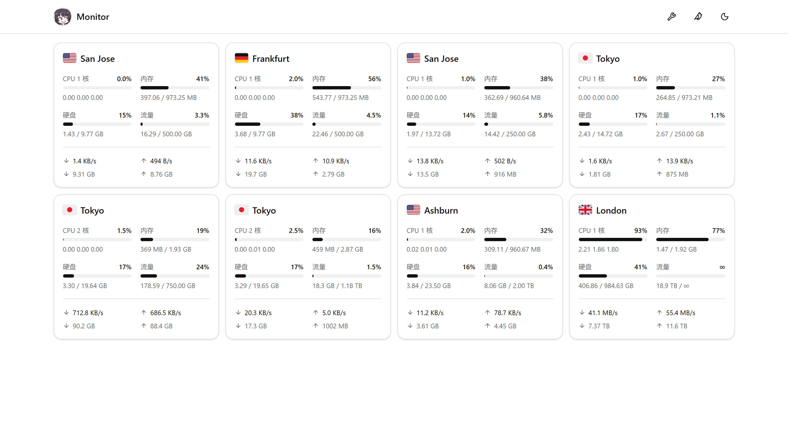
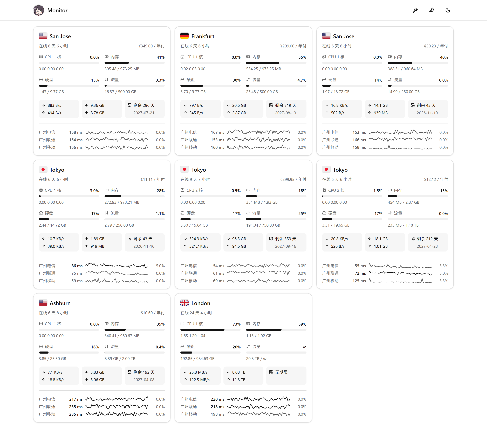

# jikasei

极简探针（[Monitor](https://github.com/monitor-probe/monitor)）的第三方主题，源码基于上游默认主题
`monitor-theme-default` v1.1.0 改造。纯静态前端，只读 hub 的公开接口，
国旗与图标资源都自带。

## 预览

左起：「经典」「延迟」「详细」三种卡片形态。

| 经典形态（默认） | 延迟形态 | 详细形态 |
|---|---|---|
|  |  |  |

## 安装

首次安装需从 Releases 下载 theme.tar.gz 上传至探针后台，后续可在主题卡片上点击从 GitHub 更新。

## 主题设置

后台「主题」页的「主题设置」，改完对访客立即生效（值存在 hub 的站点配置里，访客端不落副本）：

| 设置项 | 默认 | 说明 |
|---|---|---|
| 站点图标 | `/site-icon.png` | 顶栏那枚 32px 圆形站标的地址，同时也是浏览器标签页／书签／手机桌面快捷方式的图标。填完整网址或站内路径；取不到就回落到主题自带那张。 |
| 显示养鸡场入口 | 开 | 顶栏那枚小鸟图标的开关。关掉后相关的探测与渲染都不再发生。 |
| 养鸡场地址 | 空（自动） | 留空 = 自动认本站的 `/chicken/`；想固定指向别处（同域路径或完整网址）就填地址。 |
| 列表页顶部 | 都不显示 | 列表页顶部显示什么，四选一：**都不显示**（默认）／**只显示分组标签**／**只显示概览卡片**／**两个都显示**。分组标签 = 那一行「全部 / 各组 / 未分组」，节点本来就没有分组时无论如何都不显示；概览卡片 = 那行四张卡片（节点在线数、最忙节点、今日与累计流量、全站实时网速），数据都取自节点列表本身、不多发请求，只有第四张下面那条走势线画的是访客打开页面后的实时速率，刷新页面就从空的重新攒。 |
| 卡片形态 | 经典 | 卡片长什么样：「经典」网络速率与总量分两行、不含延迟（也就不去拉延迟数据）；「延迟」网络合成一行（下行在左、上行在右，各自「速率 · 累计总量」）、下方带三网延迟；「详细」在延迟之上再添在线时长、价格与到期。三种形态配色一致，只有信息多少不同。 |
| 显示的延迟线路 | 空（自动） | 卡片「三网延迟」里显示哪几条线路。每行一个 ping 任务名，最多三个，按填写的顺序显示；留空则按后台顺序自动显示前三条。名字对不上（改过名、任务删了）那一行跳过。仅在「延迟」「详细」形态下生效，数据每 60 秒刷新一次。 |

## 许可

MIT（上游 `monitor-theme-default` 的版权与许可照留，见 `LICENSE`）
