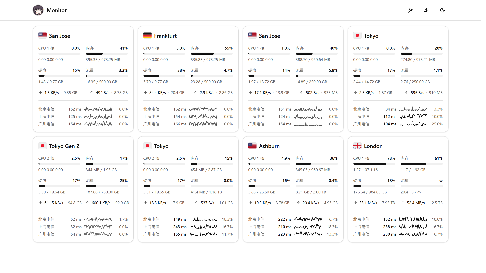

# jikasei

极简探针（[Monitor](https://github.com/monitor-probe/monitor)）的第三方主题，源码基于上游默认主题
`monitor-theme-default` v1.1.0 改造。纯静态前端，只读 hub 的公开接口，
国旗与图标资源都自带。

## 预览

左为「详细」形态，右为「经典」形态。

| 详细形态 | 经典形态 |
|---|---|
|  |  |

## 安装

首次安装需从 Releases 下载 theme.tar.gz 上传至探针后台，后续可在主题卡片上点击从 GitHub 更新。

## 主题设置

后台「主题」页的「主题设置」，改完对访客立即生效（值存在 hub 的站点配置里，访客端不落副本）：

| 设置项 | 默认 | 说明 |
|---|---|---|
| 站点图标 | `/site-icon.png` | 顶栏那枚 32px 圆形站标的地址，同时也是浏览器标签页／书签／手机桌面快捷方式的图标。填完整网址或站内路径；取不到就回落到主题自带那张。 |
| 显示养鸡场入口 | 开 | 顶栏那枚小鸟图标的开关。关掉后相关的探测与渲染都不再发生。 |
| 养鸡场地址 | 空（自动） | 留空 = 自动认本站的 `/chicken/`；想固定指向别处（同域路径或完整网址）就填地址。 |
| 显示分组标签行 | 关 | 列表页顶部那行分组标签（全部 / 各组 / 未分组）的开关。节点本来就没有分组时，这一行无论如何都不显示。 |
| 卡片形态 | 经典 | 卡片长什么样：「经典」网络速率与总量分两行、不含延迟（也就不去拉延迟数据）；「详细」网络合成一行（下行在左、上行在右，各自「速率 · 累计总量」）、下方带三网延迟。 |
| 显示的延迟线路 | 空（自动） | 卡片「三网延迟」里显示哪几条线路。每行一个 ping 任务名，最多三个，按填写的顺序显示；留空则按后台顺序自动显示前三条。名字对不上（改过名、任务删了）那一行跳过。仅在「详细」形态下生效，数据每 60 秒刷新一次。 |

## 许可

MIT（上游 `monitor-theme-default` 的版权与许可照留，见 `LICENSE`）
