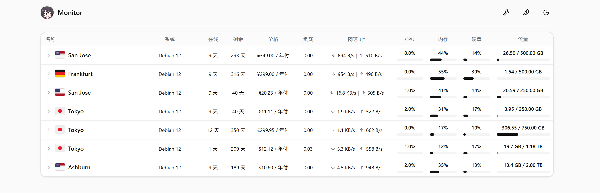

# jikasei

极简探针（[Monitor](https://github.com/monitor-probe/monitor)）的第三方主题，源码基于上游默认主题
`monitor-theme-default` v1.1.0 改造。纯静态前端，只读 hub 的公开接口，
国旗与图标资源都自带。

## 预览

左起：「经典」「延迟」「详细」「紧凑」四种卡片形态。

| 经典形态（默认） | 延迟形态 | 详细形态 | 紧凑形态 |
|---|---|---|---|
|  |  |  |  |

## 安装

首次安装需从 Releases 下载 theme.tar.gz 上传至探针后台，后续可在主题卡片上点击从 GitHub 更新。

## 主题设置

后台「主题」页的「主题设置」，改完对访客立即生效（值存在 hub 的站点配置里，访客端不落副本）：

| 设置项 | 默认 | 说明 |
|---|---|---|
| 站点图标 | `/site-icon.png` | 顶栏那枚 32px 圆形站标的地址，同时也是浏览器标签页／书签／手机桌面快捷方式的图标。填完整网址或站内路径；取不到就回落到主题自带那张。 |
| 养鸡场入口 | 空（自动） | 顶栏那枚小鸟图标的去处，三种状态挤在一格里：留空 = 自动认本站 `/chicken/`（装了才显示）；填 `off` = 不显示入口（相关的探测与渲染都不再发生）；填地址 = 固定指向别处（同域路径或完整网址）。 |
| 列表页顶部 | 都不显示 | 列表页顶部显示什么，六选一：**都不显示**（默认）／**只显示分组标签**／**只显示概览卡片·原版**／**只显示概览卡片·价值版**／**两个都显示·概览卡片原版**／**两个都显示·概览卡片价值版**。分组标签 = 那一行「全部 / 各组 / 未分组」，节点本来就没有分组时无论如何都不显示；概览卡片 = 那行统计卡片，数据都取自节点列表本身、不多发请求，只有实时网速那张下面那条走势线画的是访客打开页面后的实时速率，刷新页面就从空的重新攒。原版是四张卡片各一块读数（节点在线数、最忙节点、今日与累计流量、全站实时网速）；月度预算剩余价值版把前两张各排两块读数——第一张是「月度预算」与「剩余价值」，第二张是「节点」与「最忙节点」（两块分居卡片两端）。**月度预算** = 各节点价格按计费周期摊到每月后相加；**剩余价值** = 已付但没用完的那一段（价格 × 剩余天数 ÷ 周期天数）；两者都按主题里写死的固定汇率折成人民币显示（因此写「≈」，口径与汇率在悬停提示里），一次性买断、没填价格、没有到期日的机器不计入。 |
| 卡片形态 | 经典 | 卡片长什么样：「经典」网络速率与总量分两行、不含延迟（也就不去拉延迟数据）；「延迟」网络合成一行（下行在左、上行在右，各自「速率 · 累计总量」）、下方带三网延迟；「详细」在延迟之上再添在线时长、价格与到期；「紧凑」换成一行一台的表格（名称 / 系统 / 在线 / 剩余 / 价格 / 负载 / 网速 / CPU / 内存 / 硬盘 / 流量，列随屏宽收放、每个指标带一条细进度条），一屏能排下两三倍。**紧凑形态点一行就地展开**——展开行里挂的是那张带 1 / 6 / 24 小时 / 7 天范围与削峰开关的延迟图（不跳详情页），要去整页详情点展开行右上角的入口。四种形态配色与读数口径一致，只有信息多少与排布不同。 |
| 服务器备注 | 空（关闭） | 只在「详细」形态上生效的备注标签。每行一台：`服务器名=备注`；`#` 开头的行是注释；备注里用逗号分隔就是多枚标签（`东京机=三网优化,备用` 挂两枚），排不下时自动折行。留空 = 关闭，「详细」卡片与 1.5.0 完全一样（在线时长在左、价格在右、第三枚读数盒下面写到期日）。填了内容即开启，卡片改成：备注标签落在原先在线时长的位置、在线时长右移、价格从第二行移进第三枚读数盒的下面一行（上面仍是剩余时间，金额前的货币符号单独占一列、与上面的时钟图标对齐；到期日不再显示）。 |
| 显示的延迟线路 | 空（自动） | 卡片「三网延迟」里显示哪几条线路。每行一个 ping 任务名，最多三个，按填写的顺序显示；留空则按后台顺序自动显示前三条。名字对不上（改过名、任务删了）那一行跳过。仅在「延迟」「详细」形态下生效，数据每 60 秒刷新一次。 |

## 许可

MIT（上游 `monitor-theme-default` 的版权与许可照留，见 `LICENSE`）
